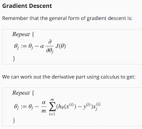

Pseudo Code
1.	Instantiate Logistic regression with value of learning rate and number of iteration.

2.	Define method to calculate  Sigmoid function

3.	Define method to calculate loss function (Cost function)

4.	Train using Gradient descent  to minimize the loss function

            For loop
            -	Calculate sum of product of feature matrix and weight, Z
            -	Calculate hypothesis h by sigmoid(Z)
            -	Calculate gradient
            -	Update weight

    

5.	Make predictions using trained weight

### NB: 

** User can decide whether to use intercept or not by passing the `fit_intercept` argument when instantiating LogisticRegression

** User can choose preferred threshold by using the threshold argument in `.predict()` method
